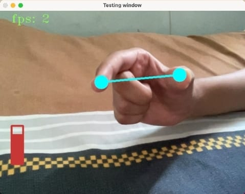

# OpenCV

<h1>Table of Contents</h1>
<ul>
  <li>Projects Listed</li>
  <li>Base Codes</li>
</ul>
<h2>Projects Listed</h2>

This repository contains projects that make use of OpenCV.  
They are :- 
<ol>
  <li>Volume Gesture Control</li>
  <li>Virtual Painter</li>
  <li>Virtual Mouse</li>
  <li>Finger Counter</li>
</ol>
Along with the project files, this repository also contains the simple base codes for Hand Tracking, Face Mesh Analysis and Pose Tracking. 
These base codes might help you in case you do not want to dive into a project yet but just want to have a look at the tracking and mesh.  
These files have been made on PyCharm and on macOS so some of the libraries might require a Windows Substitute.
<h4>Volume Gesture Control</h4>
Demonstration  
  

 

Modules used :
<ul>
  <li>cv2 - for video capturing </li>
  <li>NumPy</li>
  <li>time</li>
  <li>MediaPipe - for hand tracking</li>
  <li>math - for the logical part that controls volume control based on video input</li>
  <li>subprocess - for system volume controlling (mac compatible)</li>
  <li>pycaw - same function as subprocess but for Windows</li>
</ul>
<h4>Virtual Painter</h4>
Modules used :
<ul>
  <li>cv2 - for video capturing </li>
  <li>os</li>
  <li>time</li>
  <li>MediaPipe - for hand tracking</li>
</ul>
<h4>Virtual Mouse</h4>
Modules used :
<ul>
  <li>cv2 - for video capturing </li>
  <li>NumPy</li>
  <li>time</li>
  <li>MediaPipe - for hand tracking</li>
  <li>math - for the logical part that controls volume control based on video input</li>
  <li>pyautogui - for system selection controlling (mac compatible)</li>
  <li>autopy - same function as pyautogui but for Windows</li>
</ul>
<h4>Finger Counter</h4>
Modules used :
<ul>
  <li>cv2 - for video capturing </li>
  <li>os</li>
  <li>time</li>
  <li>MediaPipe - for hand tracking</li>
</ul>

<h2>Base Codes</h2>
<ul>
  <li>Hand Tracking</li>
  <li>Face mesh</li>
  <li>Pose Tracking</li>
</ul>
